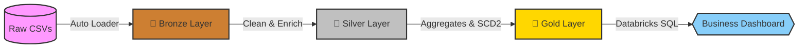

<h1 align="center">⚙️ ServiceTrack Analytics Pipeline</h1>

  
  
  
  
  

  
  
  

---

### 📝 Project Details

| 🏢 Company | 👨‍💻 Data Engineer | 👨‍🏫 Mentor(s) | 👩‍💼 HR Coordinator |
| :--- | :--- | :--- | :--- |
| **Celebal Technologies** | Yaksh Yadav | [Yashashvi Dubey](https://www.linkedin.com/in/yashashvi-dubey-92a3862a8/) & [Raj Biswas](https://www.linkedin.com/in/raj-biswas-1a07aa277/) | [Priyanshi Jain](https://www.linkedin.com/in/priyanshi-jain20/) |

---

## 📌 What This Is

A batch data engineering pipeline that turns raw, messy service-center job exports into clean, business-ready analytics — built end-to-end on Databricks using PySpark, Delta Lake, Auto Loader, and Unity Catalog. It follows the Medallion Architecture (Bronze → Silver → Gold) and answers five questions a service center manager can't currently answer from raw job cards: repair turnaround, technician performance, repeat customers, device failure trends, and customer visit history.

**Source data:** 300 customers · 43 devices · 1,510 service jobs (90-day window, Jan–Mar 2024), with intentional data quality issues — 10 duplicate `job_id` rows and ~75 blank `technician_name` values — used to demonstrate real cleansing logic rather than a clean toy dataset.

---

## 📊 Business Impact & Final Dashboard

The dashboards below visualize the final Gold-layer data, tracking technician efficiency, SLA compliance, and device failure trends.

> **Note:** keep `dashboard1.png` and `dashboard2.png` in the same folder as this README (not `dashboard1.png.png` — GitHub won't resolve the double extension).

---

## 🏗️ Pipeline Architecture (Medallion Design)

Data flows through a strict Medallion Architecture, ensuring data quality at every stage and enabling Delta Lake time-travel auditing throughout.

| Layer | What happens | Storage |
|---|---|---|
| 🥉 **Bronze** | Incremental ingestion via Auto Loader (`cloudFiles`), explicit schemas, metadata columns (`_ingestion_timestamp`, `_source_file`, `_load_date`) | `/Volumes/servicetrack/data/landing/delta/bronze/*` |
| 🥈 **Silver** | De-dup, quarantine invalid rows, backfill `technician_name`, type dates, compute `repair_duration_days`, broadcast-join customers + devices | `/Volumes/servicetrack/data/landing/delta/silver/enriched_service_jobs` |
| 🥇 **Gold** | Three business aggregates + an SCD Type 2 technician dimension | `/Volumes/servicetrack/data/landing/delta/gold/*` |

---

## 🥇 Gold Layer Tables

| Table | Grain | Key columns |
|---|---|---|
| `SLA_Performance_Gold` | device brand × device type | `total_jobs`, `on_time_jobs`, `delayed_jobs`, `sla_compliance_percentage` |
| `Technician_Efficiency_Gold` | technician | `average_repair_duration`, `completed_repairs`, `total_revenue`, `average_repair_cost` |
| `Failure_Trends_Gold` | device brand × model series | `repair_volume`, `total_repair_cost` |

Plus ad hoc SQL analytics on top of Silver: repeat-customer detection (`GROUP BY ... HAVING`), most-recent-visit-per-customer (`ROW_NUMBER()` window function via CTE), and a `technician_dim_scd2` dimension table maintained with a Delta Lake `MERGE` to preserve technician attribute history.

---

## ✅ Data Quality & Validation

Every run executes 5 automated checks before Gold data is considered final — row conservation across Bronze→Silver, no null keys, no duplicate `job_id`, SLA percentages within `[0, 100]`, and technician names fully backfilled. The pipeline raises and halts if any check fails, rather than shipping bad numbers silently.

**Last successful run:**

| Metric | Value |
|---|---|
| Bronze rows ingested | 1,510 |
| Silver enriched rows (post dedup) | 1,500 |
| Quarantined rows | 0 |
| Gold `SLA_Performance_Gold` rows | 43 |
| Gold `Technician_Efficiency_Gold` rows | 8 |
| Gold `Failure_Trends_Gold` rows | 43 |
| Validation checks passed | 5 / 5 |

---

## 🧰 Tech Stack & Why

| Tool | Role |
|---|---|
| **PySpark** | All Bronze/Silver/Gold transformations; Catalyst Optimizer drives join reordering and predicate pushdown |
| **Delta Lake** | ACID writes, schema enforcement, time travel, `MERGE` for SCD2 |
| **Auto Loader** | Incremental, checkpointed CSV ingestion with schema tracking |
| **Unity Catalog Volumes** | Governed storage for source files and Delta tables |
| **Spark SQL** | Window functions, CTEs, `GROUP BY … HAVING` for repeat-customer and recency analytics |

**Performance:** `OPTIMIZE` + `ZORDER BY (device_brand, technician_id)` on the Silver enriched table, compaction on all Gold tables, and `VACUUM` with a safe 168-hour retention window.

---

## 📂 Repo Contents

- `ServiceTrack_Pipeline.ipynb` — the full Databricks notebook (import directly)
- `PROJECT_OVERVIEW_SIMPLE.md` — plain-language explanation of the project
- `ServiceTrack_Project_Report.docx` — formal written report
- `dashboard1.png`, `dashboard2.png` — Gold-layer dashboard screenshots

---

<i>Built as part of the Celebal Technologies CEI Program 2026.</i>

