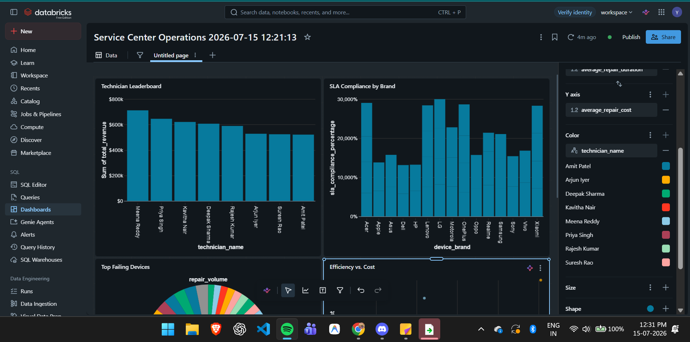
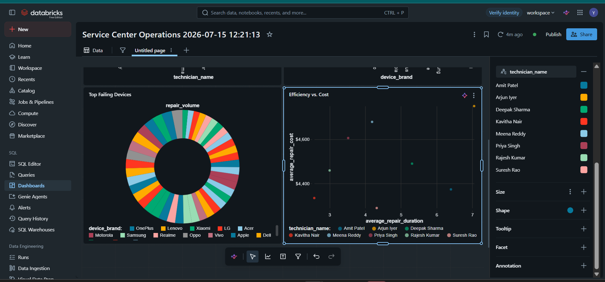

<h1 align="center">⚙️ ServiceTrack Analytics Pipeline</h1>

<p align="center">
  
  
  
  
</p>

## 📊 Business Impact & Final Dashboard
This project transforms raw, messy service center exports into a structured analytics infrastructure. The dashboards below visualize the final Gold-layer data, tracking technician efficiency, SLA compliance, and device failure trends.




---

## 🏗️ Pipeline Architecture (Medallion Design)
The data flows through a strict Medallion Architecture, ensuring data quality and enabling time-travel auditing.

```mermaid
graph LR
    A[(Raw CSVs)] -->|Auto Loader| B[🥉 Bronze Layer]
    B -->|Clean & Enrich| C[🥈 Silver Layer]
    C -->|Aggregates & SCD2| D[🥇 Gold Layer]
    D -->|Databricks SQL| E{{Business Dashboard}}
    
    style A fill:#f9f,stroke:#333,stroke-width:2px
    style B fill:#cd7f32,stroke:#333,stroke-width:2px
    style C fill:#c0c0c0,stroke:#333,stroke-width:2px
    style D fill:#ffd700,stroke:#333,stroke-width:2px
    style E fill:#87cefa,stroke:#333,stroke-width:2px

    ---

### 📝 Project Details
| 🏢 Company | 👨‍💻 Data Engineer | 👨‍🏫 Mentor(s) | 👩‍💼 HR Coordinator |
| :--- | :--- | :--- | :--- |
| **Celebal Technologies** | Yaksh Yadav | [Yashashvi Dubey](https://www.linkedin.com/in/yashashvi-dubey-92a3862a8/) & [Raj Biswas](https://www.linkedin.com/in/raj-biswas-1a07aa277/) | [Priyanshi Jain](https://www.linkedin.com/in/priyanshi-jain20/) |

---
